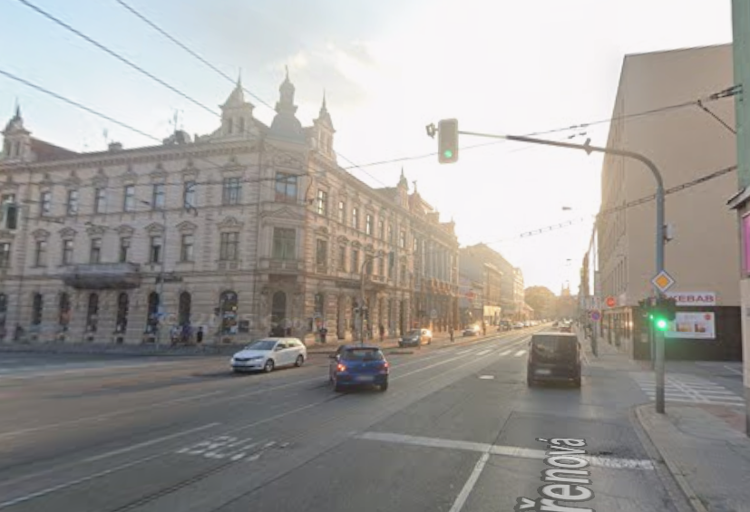
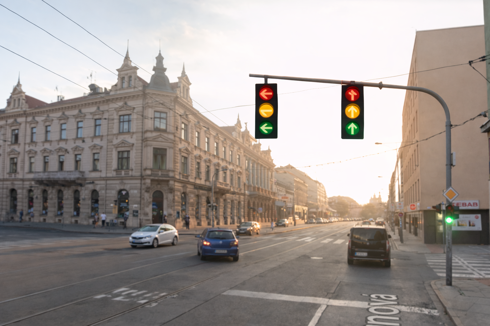
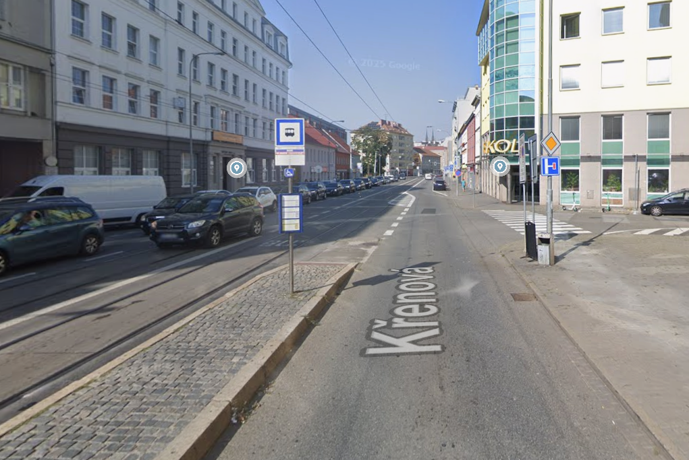
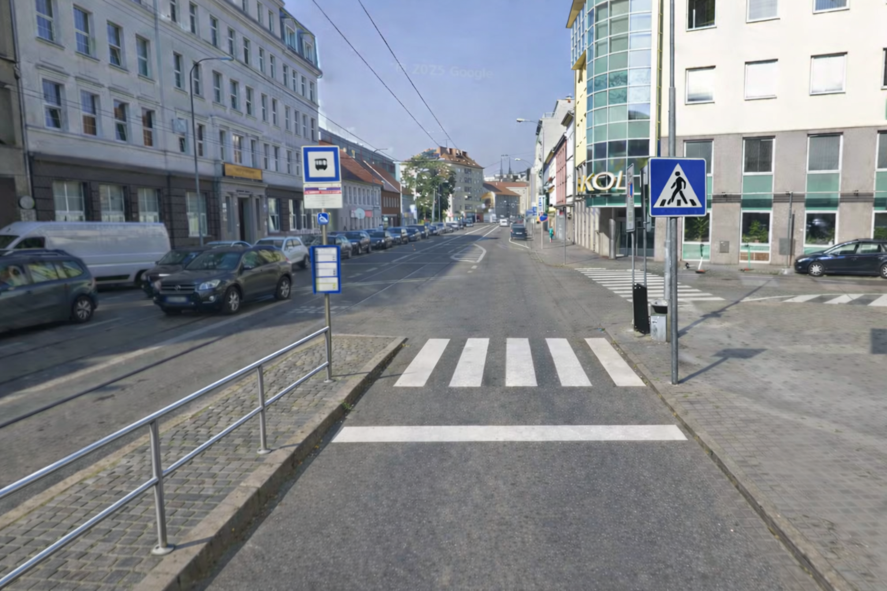

# Projekt: Bezpečná křižovatka

---

## 1. Cíl projektu

Cílem projektu je zvýšit bezpečnost a plynulost dopravy na křižovatce Křenová–Masná v Brně (Trnitá). Jedná se o místo s vysokou frekvencí chodců, automobilů i tramvají, kde dlouhodobě dochází k nebezpečným situacím při levém odbočení a při pohybu chodců mezi zastávkou a chodníkem.

Projekt navrhuje instalaci samostatného semaforu pro levé odbočení, nový přechod pro chodce, synchronizaci semaforů a doplnění zábradlí, aby se zvýšila bezpečnost všech účastníků provozu.

---

## 2. Vizualizace

#### Semafor 

| Pred | Po |
|-|-|
|  |  |

| Navrhovaný semafor | Podobný existující semafor |
|-|-|
| <iframe src="https://www.google.com/maps/embed?pb=!4v1770230312641!6m8!1m7!1sI32ozzfJFUxCdGGKIsxQlw!2m2!1d49.19133539139823!2d16.62649540300491!3f263.33072085827234!4f-6.317946711252603!5f0.7820865974627469" width="100%" height="300" style="border:0;" loading="lazy"></iframe> | <iframe src="https://www.google.com/maps/embed?pb=!4v1770230665711!6m8!1m7!1sPSXlFbIrndy5pd98WPTuJw!2m2!1d49.20064745284424!2d16.60766403229405!3f178.24732917024772!4f0.28937342850903747!5f0.4024170288903301" width="100%" height="300" style="border:0;" loading="lazy"></iframe> |

#### Přechod

| Pred | Po |
|-|-|
|  |  |

| Navrhovaný přechod | Existující přechod |
|-|-|
| <iframe src="https://www.google.com/maps/embed?pb=!4v1770230248938!6m8!1m7!1sYpZRYpwPe7dflyp-gAMgcQ!2m2!1d49.19130953498015!2d16.62498785301657!3f279.5013074111214!4f-14.84683929951953!5f0.7820865974627469" width="100%" height="300" style="border:0;" loading="lazy"></iframe> | <iframe src="https://www.google.com/maps/embed?pb=!4v1770230528712!6m8!1m7!1shybSMTaxoDMUgbALKw3GtA!2m2!1d49.19162501170403!2d16.62016028832758!3f301.41185604741787!4f-1.9242934156396103!5f1.6261947506508059" width="100%" height="300" style="border:0;" loading="lazy"></iframe> |

#### Nesynchronizované semafory

| Nesynchronizované semafory | 
|-|
| <iframe src="https://www.google.com/maps/embed?pb=!4v1772631249387!6m8!1m7!1s2k-6NjyytV9KkP46uI-RRQ!2m2!1d49.19130488132351!2d16.6257593775877!3f112.77384563988943!4f-2.727950020093573!5f1.1840825416597038" width="100%" height="300" style="border:0;" loading="lazy"></iframe> |

---

## 3. Lokalita

- **Město:** Brno – Trnitá  
- Křižovatka Křenová–Masná, oblast s tramvajovým provozem a vysokou frekvencí chodců i automobilů.

---

## 4. Problém

- Na křižovatce dlouhodobě dochází k nebezpečným situacím při levém odbočení směrem na Masnou, kde vozidla kříží tramvajový provoz. 

- Chodci nemají bezpečný a legální způsob, jak se dostat mezi tramvajovou zastávkou a chodníkem.

- Nesynchronizované řízení přechodů, chodci často reagují intuitivně vidí zelenou na jednom semaforu a automaticky vstupují do vozovky, i když na druhém je stále červená a auta projíždějí vysokou rychlostí. To vede k nebezpečným situacím. Je nutné nastavit semafory tak, aby se zelená rozsvítila na obou přechodech současně a předešlo se chybným reakcím chodců.

---

## 5. Nápad a popis řešení

- Instalace **samostatného semaforu pro levé odbočení**, který eliminuje konflikt s tramvajemi.  
- Vyznačení **nového přechodu pro chodce** mezi zastávkou a chodníkem.  
- Instalace **zábradlí na nástupišti**, které zabrání vstupu chodců do vozovky mimo přechod.  
- **Synchronizace semaforů pro chodce**, aby nedocházelo k intuitivním, ale chybným reakcím na jiný signál.  
- Cílem je snížit riziko kolizí tramvají, automobilů a chránit chodce.

---

## 6. Veřejný prospěch

Projekt zlepšuje bezpečnost a plynulost dopravy pro **všechny uživatele této oblasti**:

- Řidiči levého odbočovacího pruhu získají jistotu bezpečného odbočení.  
- Cestující tramvají budou lépe chráněni před kolizemi způsobenými nesprávným odbočováním aut.  
- Chodci získají jasně vyznačený přechod a snížené riziko střetu s vozidly.  
- Projekt je přínosný **pro všechny, kdo denně projíždějí nebo procházejí touto oblastí**, nikoli jen pro jednu skupinu.

---

## 7. Rozpočet projektu

### 7.1 Realizace projektu (pořízení a instalace)

| Položka | Počet / jednotky | Cena za jednotku | Cena celkem | Zdroj / poznámka |
|-|-|-|-|-|
| Semafor – LED hlava | 1 ks | 4 700 Kč | 4 700 Kč | [Technopark – 3-komorový LED semafor](https://eshop.technopark.cz/z9915-sem3-semafor-3-komorovy-cervena-zluta-zelena) |
| Montáž semaforu + kabeláž + úprava DB | 1 | 150 000 Kč | 150 000 Kč | Orientační cena práce + materiál |
| Montáž zábradlí a vyznačení přechodu | 1 | 100 000 Kč | 100 000 Kč | Orientační cena včetně práce a materiálu |
| Úprava řadiče SSZ | 1 | 40 000 Kč | 40 000 Kč | Orientační cena práce + materiál |
| Vyznačení přechodu pro chodce | 3 | 1 595 Kč | 4 785 Kč | Barva Signocryl S2856: [Heureka](https://fasadni-barvy.heureka.cz/signocryl-s2856-barva-na-vodorovne-dopravni-znaceni-vozovek-0100-bila-4-l/) |
| Dopravní značka IP6 | 1 | 2 439 Kč | 2 439 Kč | [Znacka](https://www.znaceni-eshop.cz/Dopravni-znacka-zvyraznena-IP6-Prechod-pro-chodce-d349.htm) |
| Půjčení plošiny (1 den) | 1 | 3 680 Kč | 3 680 Kč | [Půjčovna Vlk](https://www.pujcovna-vlk.cz/detail-produktu/316/bateriova-kloubova-plosina-16m#order) |
| Zábradlí | 10 | 3 061 Kč | 30 610 Kč | [Délka 2000 mm – žárový zinek](https://www.obexia.cz/cs/zesilene-obloukove-zabradli-1163p.html) |
| **Cena celkem realizace** | | | **336 214 Kč** | |

### 7.2 Projektová dokumentace

| Položka | Počet | Cena za jednotku | Cena celkem |
|-|-|-|-|
| Projektová dokumentace, technický dozor, BOZP | 1 | 80 000 Kč | 80 000 Kč |

### 7.3 Roční provozní náklady (3 roky)

| Položka | Počet (roky) | Cena ročně | Cena celkem |
|-|-|-|-|
| Údržba semaforu / signalizace | 3 | 1 000 Kč | 3 000 Kč |
| Údržba přechodu / značení | 3 | 10 000 Kč | 30 000 Kč |
| **Celkem provozní náklady** | | | **33 000 Kč** |

### 7.4 Shrnutí rozpočtu

| Sekce projektu | Cena celkem |
|-|-|
| Realizace | 336 214 Kč |
| Projektová dokumentace | 80 000 Kč |
| Provozní náklady (3 roky) | 33 000 Kč |
| **Celkem (orientačně)** | **449 214 Kč** |

---

> Ceny jsou orientační a vycházejí z tržních nabídek (semafory, barvy, značení, plošiny). Konečné náklady budou upřesněny po oslovení dodavatelů a zpracování projektové dokumentace.